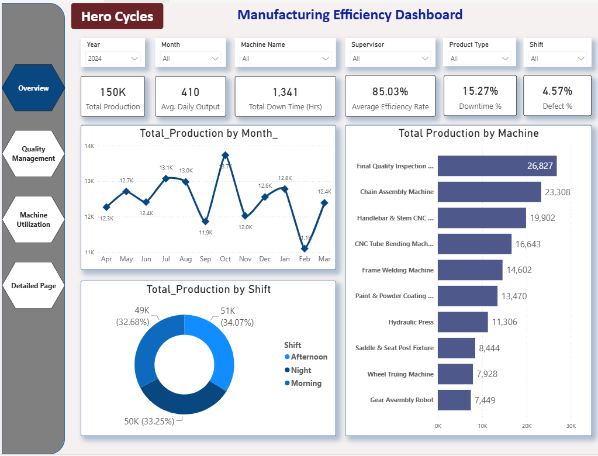
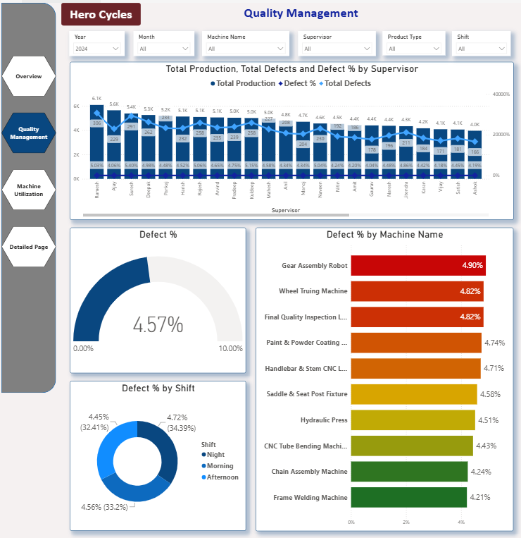
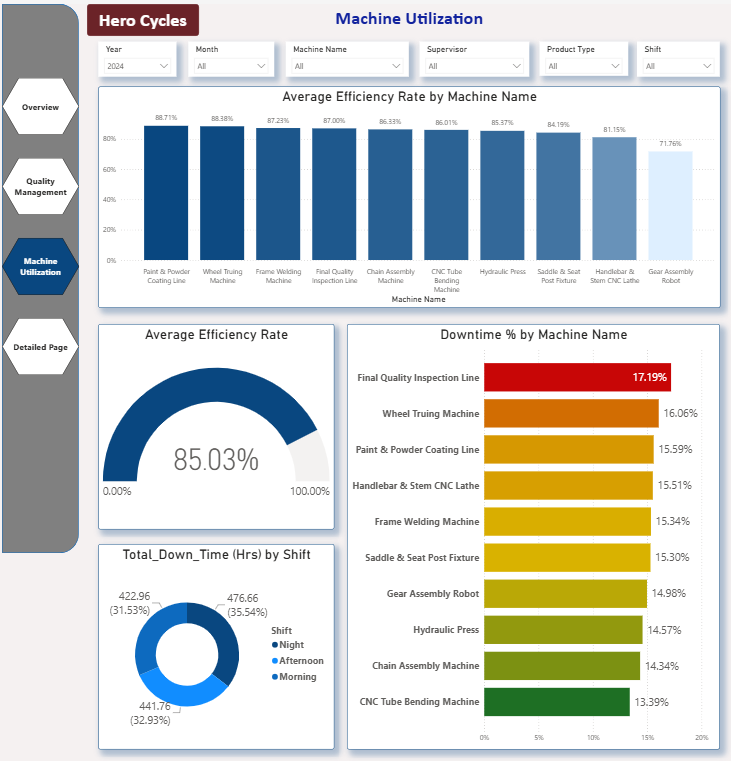
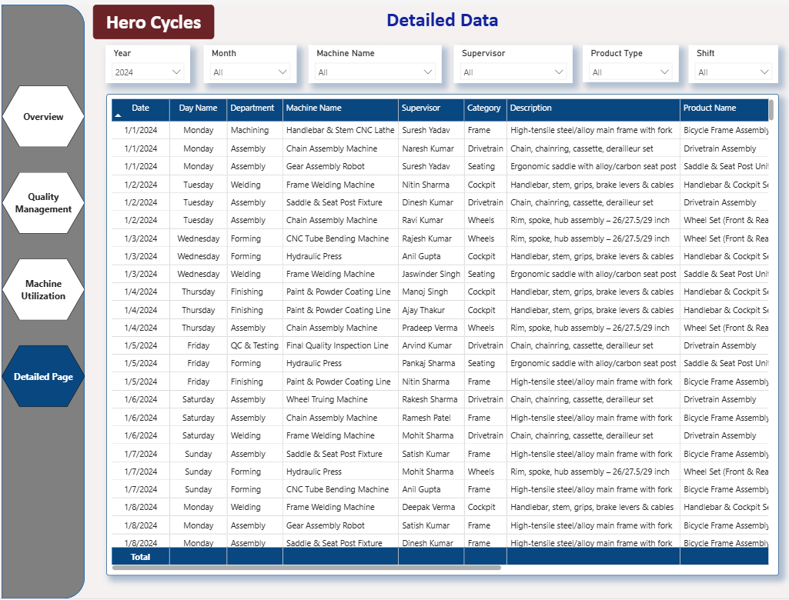

# Hero Cycles Manufacturing Efficiency Dashboard

## Project Overview

This Power BI project was developed for Hero Cycles to provide comprehensive visibility into manufacturing operations, production efficiency, quality performance, and machine utilization. The dashboard enables stakeholders to monitor key production metrics, identify operational bottlenecks, track quality issues, and improve overall manufacturing performance through data-driven decision-making.

The solution combines production analytics, quality management, machine utilization monitoring, and detailed operational reporting into a centralized reporting platform.

---

## Business Problem

Manufacturing operations generate large volumes of production, quality, and machine performance data. Monitoring these metrics through spreadsheets and manual reports makes it difficult to identify inefficiencies, downtime issues, and quality concerns in a timely manner.

The organization required a centralized analytics solution to:

* Monitor production performance.
* Track machine efficiency and downtime.
* Measure product quality and defect rates.
* Analyze shift-wise and supervisor-wise performance.
* Identify production bottlenecks.
* Improve operational efficiency and decision-making.

---

## Solution

Developed a four-page Power BI dashboard to provide end-to-end visibility into manufacturing operations.

### Overview Dashboard

Provides a high-level summary of manufacturing performance through key operational KPIs and production trends.

### Quality Management Dashboard

Focuses on defect analysis, quality monitoring, and supervisor performance evaluation.

### Machine Utilization Dashboard

Tracks machine efficiency, downtime, and production utilization across manufacturing operations.

### Detailed Data Dashboard

Provides transaction-level visibility for production, quality, and machine performance analysis.

---

## Dashboard Screenshots

### Manufacturing Efficiency Dashboard



### Quality Management Dashboard



### Machine Utilization Dashboard



### Detailed Data Dashboard



---

## Key Business Questions Answered

### Production Analytics

* What is the total production output?
* How does production vary by month, machine, and shift?
* Which machines contribute the highest production volume?
* What is the average daily production output?

### Quality Management

* Which supervisors have the highest defect rates?
* Which machines generate the highest number of defects?
* How do defect rates vary across shifts?
* What is the overall defect percentage?

### Machine Utilization

* Which machines have the highest efficiency rates?
* Which machines experience the highest downtime?
* How does downtime impact operational efficiency?
* Which shifts achieve the highest utilization levels?

### Operational Performance

* Which departments perform most efficiently?
* What are the major contributors to downtime?
* How can production efficiency be improved?

---

## Dashboard Features

### Overview Dashboard

#### KPI Metrics

* Total Production
* Average Daily Output
* Total Downtime (Hours)
* Average Efficiency Rate (%)
* Machine Downtime (%)
* Defect Percentage (%)

#### Visual Analysis

* Monthly Production Trends
* Production by Machine
* Production by Shift

### Quality Management Dashboard

#### KPI Analysis

* Total Production by Supervisor
* Total Defects by Supervisor
* Defect Percentage by Supervisor
* Defect Percentage by Machine
* Defect Percentage by Shift

### Machine Utilization Dashboard

#### Performance Analysis

* Average Efficiency Rate by Machine
* Downtime Percentage by Machine
* Average Efficiency Rate Overview
* Total Downtime by Shift

### Detailed Data Dashboard

Provides detailed operational records including:

* Date
* Day Name
* Machine Name
* Department
* Supervisor
* Category
* Category Description
* Product Name
* Shift Type
* Total Production
* Total Defects
* Defect Percentage
* Downtime (Hours)
* Downtime Percentage
* Average Efficiency Rate

---

## Interactive Filters

The dashboard includes dynamic filtering capabilities for:

* Year
* Month
* Machine Name
* Supervisor
* Product Type
* Shift

These filters allow users to perform detailed root-cause analysis and operational investigations.

---

## Data Model & Analytics

The solution utilizes Power BI data modeling and DAX calculations to generate manufacturing KPIs and performance metrics.

### Analytics Areas

* Manufacturing Analytics
* Production Monitoring
* Quality Management
* Machine Utilization Analysis
* Operational Performance Tracking
* Efficiency Monitoring

---

## Tools & Technologies

* Power BI Desktop
* Power BI Service
* DAX
* Power Query
* Data Modeling
* Microsoft Excel
* Data Visualization

---

## Skills Demonstrated

* Power BI Development
* Manufacturing Analytics
* Production Planning Analytics
* Quality Management Analytics
* Machine Utilization Analysis
* DAX
* Power Query
* Data Modeling
* KPI Development
* Dashboard Design
* Business Intelligence
* Data Storytelling

---

## Business Impact

The dashboard provides manufacturing leadership with a single source of truth for production and operational performance. It enables proactive monitoring of production efficiency, machine utilization, and quality metrics, helping stakeholders identify bottlenecks, reduce downtime, minimize defects, improve resource utilization, and support continuous improvement initiatives.

---

## Key Skills

**Power BI • DAX • Power Query • Data Modeling • Manufacturing Analytics • Production Planning • Quality Management • Machine Utilization Analysis • KPI Development • Data Visualization**

---

## Project Structure

```text
hero-cycles-manufacturing-efficiency-dashboard/
│
├── README.md
│
├── Screenshots/
│   ├── Manufacturing_Efficiency_Dashboard.png
│   ├── Quality_Management.png
│   ├── Machine_Utilization.png
│   └── Detailed_Data.png
│
├── Dataset/
│   └── Manufacturing_Data.xlsx
│   └── Machines.xlsx
│   └── Products.xlsx
│   └── Operators.xlsx
│   └── Shifts.xlsx
│
└── PowerBI/
    └── Hero_Cycles_Manufacturing_Dashboard.pbix
```

## Author

**Maninder Karda**

Senior Data Analyst | Power BI Developer

Specialized in transforming manufacturing, operational, and business data into actionable insights through advanced analytics and interactive dashboards.
